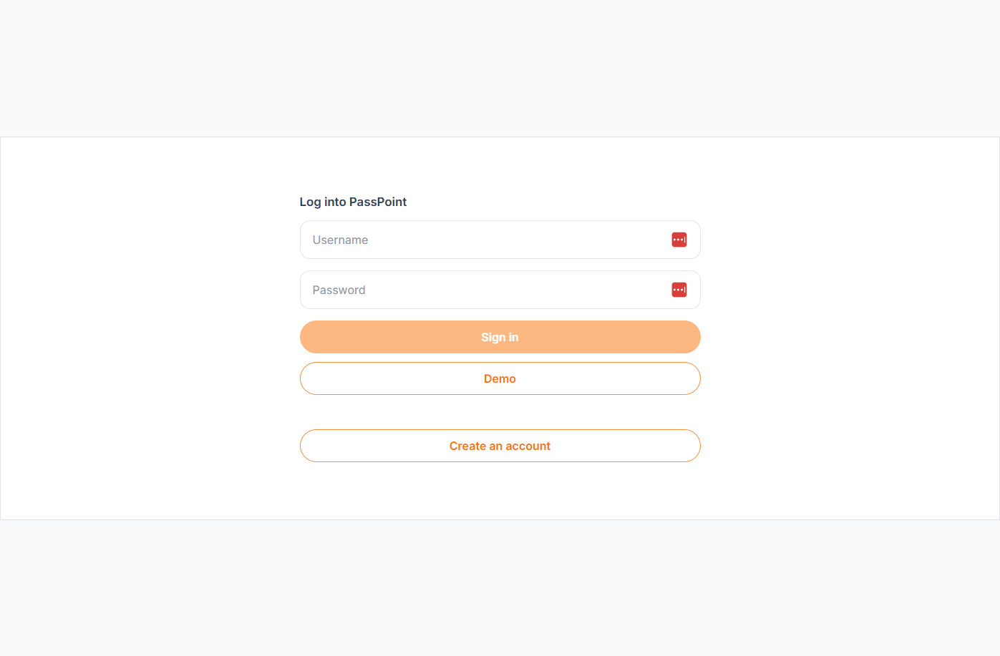
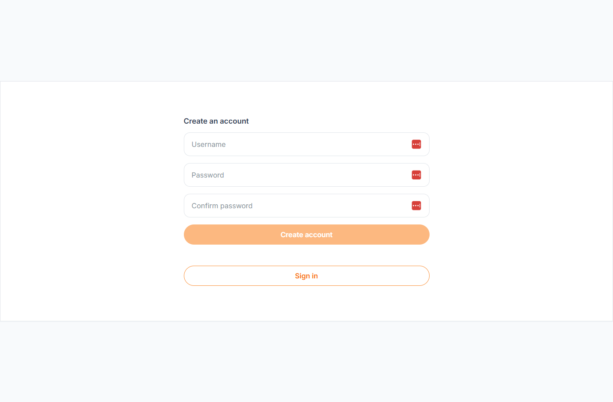
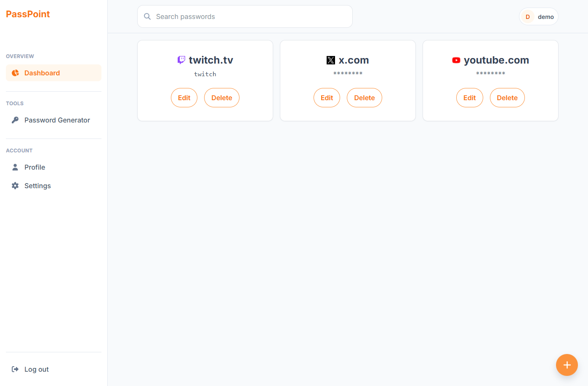
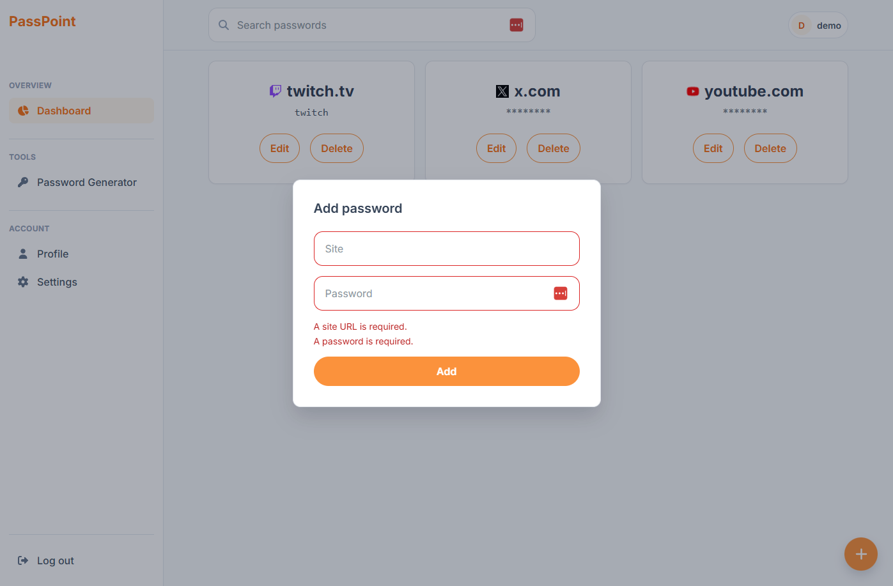
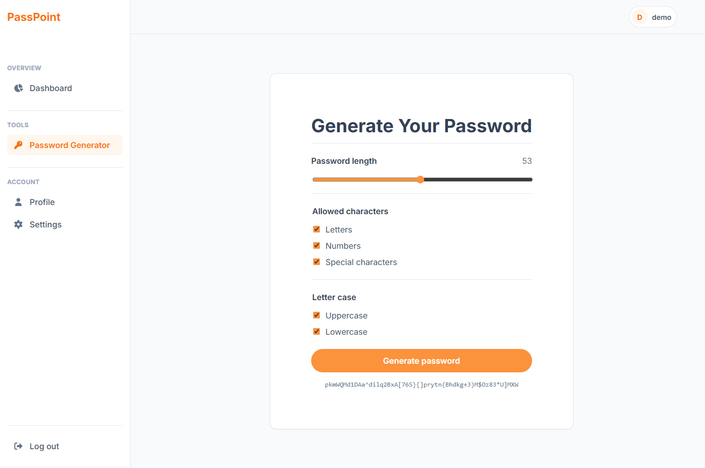

# PassPoint

PassPoint is a full-stack password-manager demonstration project that showcases backend-focused web development; use demo data only, never real passwords.

## Screenshots

| Login | Registration |
| --- | --- |
|  |  |

| Dashboard | Add password |
| --- | --- |
|  |  |

| Password generator |
| --- |
|  |

## About PassPoint

PassPoint is a project built to demonstrate a complete web application stack, with particular attention to the API, authentication, database design, and deployment workflow. Users can create an account, sign in, and manage site-password entries that belong only to their account.

Passwords are encrypted by the ASP.NET Core API before being stored in PostgreSQL and decrypted only when returned to the authenticated user. The project also includes a configurable browser-based password generator. PassPoint is intentionally a demonstration project, not a production password manager, and should only contain public sample data.

The site also offers a demo account with a quick log in. Use this for quick use of the site without having to create an account. Note Neon shuts down after a short time of inactivity so the initial login takes a minute for the database to start up. 

## Features

- Account registration, login, logout, and authenticated routes
- User-specific password-entry dashboard
- Create, view, edit, delete, and show/hide password entries
- Server-side password encryption using ASP.NET Core Data Protection
- Configurable password generator with length, character-type, and letter-case options
- Responsive desktop and mobile navigation
- Client-side form validation and API error feedback
- Automatic site favicon display when available

## Future Features

- Functional search bar for the passwords
- Folder groups for the passwords
- Further UI refinement

## Live Demo

[Open the PassPoint demo](https://pass-point-lake.vercel.app)

The Angular frontend is hosted on Vercel, utilizing docker-based ASP.NET API hosted on Render, which connects to a PostgreSQL database hosted on Neon. 

## Tools and Frameworks

| Tool / Framework | Purpose |
| --- | --- |
| [Angular](https://angular.dev/) | Frontend single-page application, routing, and reactive forms |
| [TypeScript](https://www.typescriptlang.org/) | Frontend application language |
| [Sass / SCSS](https://sass-lang.com/) | Shared design tokens and component styling |
| [Font Awesome](https://fontawesome.com/) | Interface icons |
| [ASP.NET Core](https://dotnet.microsoft.com/apps/aspnet) | Backend REST API |
| [C#](https://learn.microsoft.com/dotnet/csharp/) | Backend application language |
| [ASP.NET Core Identity](https://learn.microsoft.com/aspnet/core/security/authentication/identity) | Account management, authentication, and sessions |
| [Npgsql](https://www.npgsql.org/) | PostgreSQL data access and database migrations |
| [PostgreSQL](https://www.postgresql.org/) | Relational database |
| [Docker](https://www.docker.com/) | Local PostgreSQL development environment and API containerization |
| [Neon](https://neon.com/) | Hosted PostgreSQL database |
| [Render](https://render.com/) | Hosted ASP.NET Core API container |
| [Vercel](https://vercel.com/) | Hosted Angular frontend and API reverse proxy |
